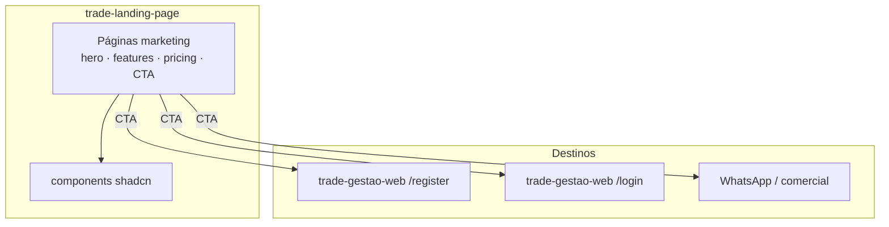
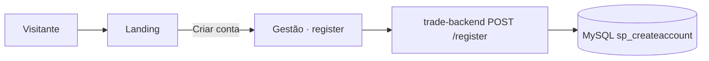

# Trade Landing Page

Site de marketing / aquisição do Trade Manager.  
Next.js independente do painel de gestão — não consome a API de operação no dia a dia; CTAs levam a login/register da gestão ou canais comerciais.

## Stack

| Peça | Uso |
|------|-----|
| Next.js | App Router / páginas estáticas |
| Tailwind + Radix (shadcn) | UI marketing |
| Vercel Analytics | Métricas |

## Arquitetura deste projeto





**Fora do caminho crítico de campo.** Não substitui `trade-gestao-web` nem o app.

## Estrutura típica

```
app/ ou pages/     # rotas marketing
components/        # blocos de UI
lib/               # utils
public/            # assets
styles/
```

## Subir local

```bash
cd trade-landing-page
npm install   # ou pnpm install
npm run dev
```

Ajuste CTAs (URLs de register/login) para o ambiente da gestão (`http://localhost:3000` em dev).

## Relação com o ecossistema

| Projeto | Papel |
|---------|--------|
| `trade-gestao-web` | Destino de CTA (login / register) |
| `trade-backend` | Register SaaS, se o CTA apontar para o fluxo novo |
| `trade-app` | Sem acoplamento direto |
